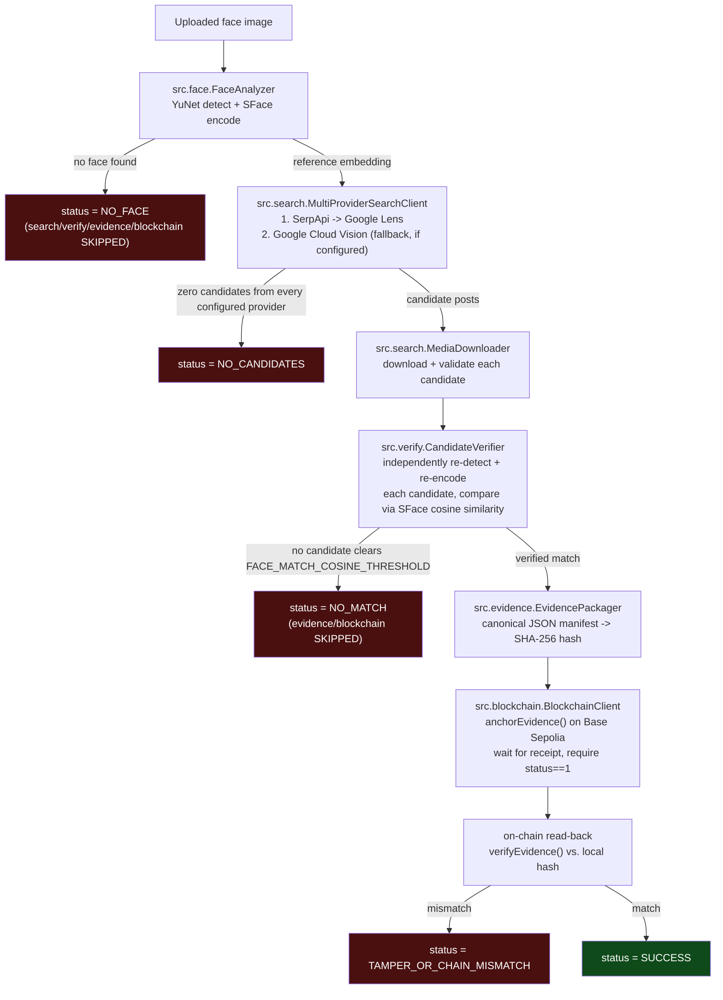

# FaceProof

FaceProof is a local-only Python application designed to verify a physical face against social media and anchor the proof on the Base Sepolia blockchain.

## Architecture



Every arrow above is a hard gate implemented in [`src/pipeline.py`](src/pipeline.py): each
stage only runs if the previous one produced a real, positive result, and the pipeline
records an explicit terminal status (`NO_FACE`, `NO_CANDIDATES`, `NO_MATCH`, `FAILED`,
`TAMPER_OR_CHAIN_MISMATCH`, `SUCCESS`) plus a machine-readable `failure_reason` code
(e.g. `NO_FACE_DETECTED`, `BELOW_MATCH_THRESHOLD`, `ONCHAIN_HASH_MISMATCH`) rather than
ever guessing or defaulting to success.

The system consists of the following independently testable modules:

- **`src.face`**: Uses OpenCV YuNet and SFace for local face detection and feature extraction without relying on external cloud APIs.
- **`src.search`**: Performs a genuine reverse-image search via SerpApi Google Lens, with an optional Google Cloud Vision fallback, to find matching candidates online. No hardcoded target posts are used.
- **`src.verify`**: Compares the local face scan with the candidates retrieved from the search, scoring the matches.
- **`src.evidence`**: Constructs a cryptographically secure manifest containing the verification results.
- **`src.blockchain`**: Anchors the evidence manifest hash to the Base Sepolia public test blockchain using Web3.py.
- **`app`**: A local Streamlit UI for the end-user to interact with the system. No production deployment or web hosting is required.

### Search provider and its limitations

The search stage's primary provider is **SerpApi's Google Lens engine** - a genuine,
programmatic reverse-image search (the image is uploaded and searched live, nothing is
scraped or hardcoded). An optional secondary provider, **Google Cloud Vision's Web
Detection API**, is tried automatically if SerpApi errors out or returns zero candidates
(see [`src/search/multi_provider.py`](src/search/multi_provider.py)). Both are free-tier
services - no paid API is required to run this project.

**Setting up the (optional) Google Cloud Vision fallback, at no cost:**
1. Create a free Google Cloud account at [console.cloud.google.com](https://console.cloud.google.com/) and a new project (Google's identity verification during signup typically asks for a card, but nothing is charged unless you explicitly enable billing beyond the free tier).
2. Enable the **Cloud Vision API** for that project.
3. Create an API key under *APIs & Services -> Credentials* and (recommended) restrict it to the Vision API only.
4. Put it in `.env` as `GOOGLE_VISION_API_KEY`. Free tier: 1,000 Web Detection lookups/month.
5. Leave it blank to run with SerpApi alone - the fallback is optional, not required.

Unlike SerpApi's upload-then-poll flow, Vision's REST API accepts the image as inline
base64 bytes directly in the request body, so no public image hosting step is needed -
the "local-only" constraint holds for both providers.

Known limitations that remain even with the fallback configured:

- **Still only two providers, both free-tier.** If both are down or both rate-limited,
  the run fails with an explicit `SEARCH`/`FAILED` event rather than silently degrading
  or substituting a different result - see `src/search/multi_provider.py`'s tests for the
  exact fallback semantics (a clean zero-result search is not the same as every provider
  erroring out, and only the latter surfaces as a hard failure).
- **A provider is only ever a fallback, never a mixer.** The first provider to return any
  candidates wins outright; a later provider's results are never merged in or used to
  override an earlier real result.
- **Result volume is capped per provider.** `MAX_SEARCH_RESULTS` (default 20, see
  `.env.example`) bounds how many candidates each provider can contribute per run, so a
  very large result set can't blow up runtime or amplify rate-limit exposure on the
  per-candidate media downloads.
- **429 (rate limited) is not retried within a provider.** A 429 moves on to the next
  configured provider (if any) rather than retrying against one that just asked to be
  backed off.
- **Match quality depends on public indexing.** If the input face has no publicly
  indexed matching photo on either provider, `NO_CANDIDATES` (or `NO_MATCH` if unrelated
  look-alikes are returned) is the *correct* outcome, not a bug.

## Constraints Adherence
- **Local-Only UI**: Uses Streamlit.
- **No LLM Dependency**: Relies on deterministic computer vision and search APIs at runtime.
- **Base Sepolia**: Serves as the public test blockchain for on-chain verification.

## Setup
1. Clone the repository.
2. Create a virtual environment: `python -m venv .venv` and activate it '.\.venv\Scripts\activate.bat'
3. Install dependencies: `pip install -r requirements.txt`
4. Copy `.env.example` to `.env` and fill in `SERPAPI_API_KEY` (get one at
   [serpapi.com](https://serpapi.com/manage-api-key)). Optionally also set
   `GOOGLE_VISION_API_KEY` for the free fallback provider - see "Search provider and its
   limitations" below. Leave the blockchain and threshold variables as-is for now - later
   steps fill them in.
5. Download local OpenCV models: `python scripts/download_models.py`

### Testnet (Base Sepolia) setup
6. Generate or reuse a **throwaway** wallet and put its private key in `PRIVATE_KEY` in
   `.env`. Never use a wallet that holds real funds - this key signs live testnet
   transactions from your machine.
7. Fund that wallet with free Base Sepolia test ETH from a faucet, e.g.
   [Base Sepolia faucet](https://www.alchemy.com/faucets/base-sepolia). You only need a
   trace amount to cover gas.
8. Deploy the `EvidenceRegistry` contract: `python scripts/deploy_contract.py`. This
   compiles `contracts/EvidenceRegistry.sol`, deploys it to Base Sepolia (chain id
   `84532`), waits for the receipt, and prints the deployed address.
9. Copy that address into `CONTRACT_ADDRESS` in `.env`.
   If you ever need a different RPC endpoint, override `BASE_SEPOLIA_RPC_URL` - any
   Base Sepolia-compatible HTTPS RPC works (e.g. an Alchemy/Infura endpoint).

### Run
10. Run the smoke test to verify all connectivity end-to-end before using the UI:
    `python scripts/smoke_test.py`
11. Run the application UI: `python run.py`

## Configuration
All tunables live in `.env` (see `.env.example` for the full commented list: search
result cap, face detection/match thresholds, media size limit, model paths). `Config.validate()`
runs at the start of every pipeline execution and raises a `ConfigurationError` (surfaced
as a clean `FAILED` pipeline stage, not a crash) if a numeric setting is out of its valid
range - e.g. a threshold outside `(0, 1]`. Missing API keys are only warned about, since
the unit test suite and offline development don't need them.

### Tuning the match threshold
`FACE_MATCH_COSINE_THRESHOLD` (default `0.65`) is the single gate between "best guess"
and "verified match" - the pipeline never treats a top search result as verified without
this independently re-computed SFace similarity clearing it. If verification runs but
nothing passes, that is usually a sign to look at *why* before touching the threshold:
is the correct media actually being downloaded (check `artifacts/<run_id>/`), is the
candidate image quality/resolution too low, is the detected face poorly aligned, or is
this genuinely a non-match.

## Logging
Every pipeline run logs structured, single-line JSON events (stage, status, message,
duration, and diagnostic details such as best-candidate score vs. threshold) to both the
console and a rotating log file at `logs/faceproof.log` (created on first run, capped at
5MB x 3 backups, ignored by git). Secrets (the SerpApi key, the wallet private key) are
never included in any log line.

`FaceProofPipeline.run()` also accepts an `on_event` callback invoked synchronously right
after each stage completes - the Streamlit UI uses this to render the pipeline log live
(search, each candidate's verification, evidence, blockchain) instead of freezing on a
single spinner until the whole run finishes.

Every halting `PipelineResult` also carries a `failure_reason` code (e.g.
`NO_FACE_DETECTED`, `ZERO_SEARCH_CANDIDATES`, `BELOW_MATCH_THRESHOLD`,
`ONCHAIN_HASH_MISMATCH`) distinct from the coarser `status` field, so both the UI and the
logs can show precisely why a run stopped rather than just that it stopped.

## Testing
```bash
# Offline unit tests (no network, no blockchain, no model files required)
python -m pytest tests/unit/

# Integration test: runs the full search -> verify -> evidence -> blockchain pipeline
# with only the network boundary (SerpApi HTTP calls) and blockchain RPC mocked -
# everything else (parsing, hashing, ranking) executes for real.
python -m pytest tests/integration/ -m "not live"

# Optional: a genuinely live SerpApi call (requires a real SERPAPI_API_KEY)
python -m pytest tests/integration/test_search_live.py --live-search
```
CI (`.github/workflows/ci.yml`) runs flake8 and both the unit and mocked-integration
suites on every push/PR.

## Known limitations
- Two free-tier search providers at most (SerpApi primary, Google Cloud Vision optional
  fallback) - see "Search provider and its limitations" above. Identical repeated
  searches for the same input image are served from a local on-disk cache
  (`.cache/search/<provider>/`, keyed by image content hash) to save API quota during
  iterative demo runs; set `SEARCH_CACHE_ENABLED=false` to always search live.
- The search and verification stages run synchronously within the Streamlit request
  (not backgrounded/async). For a single demo image this completes in a few seconds;
  this was a deliberate choice over adding threading/async to Streamlit's rerun model,
  which would add real state-management risk for negligible benefit at this scale.
- Face match thresholds (`FACE_DETECTION_THRESHOLD`, `FACE_MATCH_COSINE_THRESHOLD`) are
  empirical defaults for the YuNet/SFace model pair, not universal constants; they may
  need re-tuning for very different lighting/pose conditions.
- Requires a funded Base Sepolia testnet wallet; without one, the pipeline still runs
  through search and verification but reports `FAILED` at the blockchain stage rather
  than fabricating a transaction.
